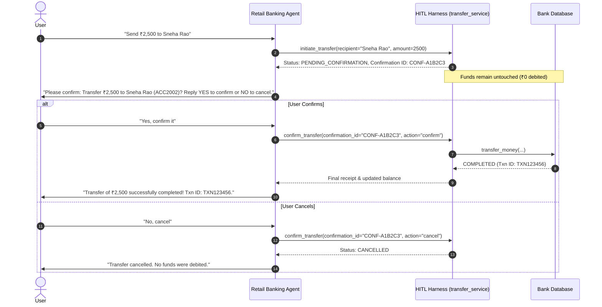

# Engineering AI Agent Harnesses: Stages 1 to 4

This document details the progressive engineering evolution of the **Retail Banking AI Agent** across four development stages, demonstrating how applying structured engineering harnesses transforms an unpredictable naive LLM into a secure, policy-compliant, human-governed, and observable production-grade agent.

---

```
                       EVOLUTION OF HARNESS ENGINEERING
                       
 [Stage 1: Naive Agent]  --->  [Stage 2: Policy Harness]
    • Direct Tool Calls           • Beneficiary Matching (0, 1, >1)
    • Unconstrained State         • amount > 0, Status == ACTIVE
    • No Safety Wrappers          • Balance & Daily Limits Check
            │                                    │
            ▼                                    ▼
 [Stage 4: Observability] <--- [Stage 3: Human-in-the-Loop]
    • Workflow Traces             • 2-Phase Commit (Initiate/Confirm)
    • Tool Latencies & Telemetry  • Pending Authorization Tickets
    • Production Issue Diagnosis  • Replay / Double-Spend Defense
```

---

## Stage 1: Naive Baseline Agent (No Harness)

### 1. Concept & Objective
In Stage 1, the agent operates in an unconstrained loop. The LLM (Gemini 3.6 Flash via Google GenAI SDK) has direct access to raw banking tools (`get_balance`, `find_beneficiaries`, `transfer_money`, `get_transaction_status`) without any interceptors, validation layer, or guardrails.

### 2. Architecture & Characteristics
- **Direct Execution**: When the LLM decides to invoke `transfer_money`, the database immediately mutates state and moves funds.
- **Unverified Inputs**: If the user inputs an ambiguous name, a negative amount, or an amount exceeding their balance, the model attempts execution directly.
- **Zero Interception**: No intermediary exists between the model's tool calls and the database ledger.

### 3. Vulnerabilities & Problems in Stage 1
- **Unregistered Recipients**: Money could be sent to non-existent or fabricated accounts.
- **Overdraft & Limit Bypasses**: The agent could attempt transfers exceeding balance or daily thresholds.
- **Ambiguity Hallucination**: If two beneficiaries shared a name (e.g., two people named "Rahul"), the naive agent would pick arbitrarily or hallucinate an account.
- **Immediate State Mutation**: No confirmation mechanism existed—a single prompt could transfer thousands of rupees irreversibly.

---

## Stage 2: Policy & Guardrails Harness (`policy_service.py`)

### 1. Concept & Objective
Stage 2 introduces the **Policy & Validation Harness**. Before any financial mutation occurs, the request is intercepted and evaluated against deterministic business policies.

### 2. Enforced Policy Rules

| Policy Rule | Validation Logic | System Action |
|---|---|---|
| **No Match** | `matches == 0` | ❌ **Reject**: No transfer allowed if recipient does not match any registered beneficiary. |
| **Ambiguous Match** | `matches > 1` | ⚠️ **Require Verification**: Pauses automatic execution, returns candidate details (Name, Account, Bank), and requires confirmation. |
| **Positive Amount** | `amount > 0` | ❌ **Reject**: Blocks zero, negative, or invalid amounts (`INVALID_AMOUNT`). |
| **Active Account** | `status == "ACTIVE"` | ❌ **Reject**: Blocks transfers from FROZEN, DORMANT, or CLOSED accounts (`INACTIVE_ACCOUNT`). |
| **Sufficient Balance** | `amount <= balance` | ❌ **Reject**: Prevents overdrafts (`INSUFFICIENT_FUNDS`). |
| **Daily Transfer Limit** | `transferred_today + amount <= limit` | ❌ **Reject**: Enforces daily spending limits (e.g. ₹50,000/day) (`DAILY_LIMIT_EXCEEDED`). |

### 3. Implementation Details
- Located in [`services/policy_service.py`](file:///c:/mppeapril/applications/collections/genai%20projects/harness%20engineering/services/policy_service.py).
- Exposes `evaluate_transfer_policy(...) -> PolicyDecision`.
- Evaluates constraints deterministically before calling the database.
- 8 automated unit tests in `tests/test_policy_service.py` validate every policy branch.

---

## Stage 3: Human-in-the-Loop (HITL) Harness (`transfer_service.py`)

### 1. Concept & Objective
While Stage 2 prevents illegal transfers, it could still execute a valid transfer in a single autonomous turn without user consent. Stage 3 introduces a **Two-Phase Human-in-the-Loop (HITL) Protocol** that mandates explicit human authorization on every bank transfer.

### 2. Two-Phase Protocol



### 3. Security & Integrity Safeguards
- **Pending Authorization Store**: Transfers are stored as `PendingTransfer` objects with a 10-minute TTL expiration.
- **Replay / Double-Spend Prevention**: Once confirmed or cancelled, a `confirmation_id` transitions to `CONFIRMED` or `CANCELLED` and cannot be re-executed.
- **Tools**: `initiate_transfer` and `confirm_transfer` in `src/bank_tools.py`.

---

## Stage 4: Observability & Monitoring Harness ("Observe the Agent")

### 1. Why Observability is Critical in Production
In production, autonomous AI agents can fail in subtle ways that traditional application servers never experience:
- **Silent Failures**: The model hallucinates an answer or calls the wrong tool without throwing an HTTP 500 error.
- **Policy Rejection Spikes**: A sudden wave of `DAILY_LIMIT_EXCEEDED` or `NO_MATCH` errors may indicate phishing, prompt injection, or broken user experiences.
- **Latency Bottlenecks**: Tool executions or external API round-trips can cause user timeouts.
- **Audit & Compliance Requirements**: In retail banking, every financial inquiry, authorization, and debit requires a non-repudiable audit trail.

The Stage 4 Observability Harness gives developers **real-time visibility into the agent's workflow** so they can monitor performance, detect anomalies, and diagnose production issues immediately.

### 2. Architecture of the Observability Harness (`observability_service.py`)

```
                    STAGE 4 OBSERVABILITY PIPELINE
                    
  [User Message] ──► [ADK Agent] ──► [Observability Harness] ──► [Structured JSONL Audit Log]
                           │                    │
                           ▼                    ▼
                    [Tool Execution]   • Tool Arguments
                    (get_balance,      • Execution Latency (ms)
                     initiate,         • Policy Decisions
                     confirm)          • Human Authorization Decisions
```

### 3. Captured Telemetry & Metrics

1. **Tool Execution Tracing**:
   - `tool_name`: Name of tool executed (`initiate_transfer`, `get_balance`, etc.).
   - `arguments`: Exact parameters passed by the LLM.
   - `elapsed_ms`: Wall-clock execution time in milliseconds.
   - `status`: `SUCCESS`, `POLICY_REJECTED`, or `FAILED`.
   - `result_summary`: Clean summary of the tool output.

2. **Human-in-the-Loop Audit Events**:
   - Tracks every `initiate_transfer` event and subsequent user decision (`confirm` vs `cancel`).
   - Records `confirmation_id`, timestamp, and outcome.

3. **Structured Storage**:
   - Logs are persisted in JSON Lines format to [`logs/agent_workflow.jsonl`](file:///c:/mppeapril/applications/collections/genai%20projects/harness%20engineering/logs/agent_workflow.jsonl) for ingestion into monitoring stacks (e.g. Google Cloud Logging, Datadog, Elasticsearch).

### 4. Sample Telemetry Log Record

```json
{
  "timestamp": "2026-09-07 17:34:05.124",
  "event_type": "TOOL_EXECUTION",
  "tool_name": "initiate_transfer",
  "arguments": {
    "source_account_id": "ACC1001",
    "recipient": "Sneha Rao",
    "amount": 2500.0,
    "remarks": "Dinner split"
  },
  "status": "SUCCESS",
  "elapsed_ms": 1.45,
  "result_summary": {
    "success": true,
    "status": "PENDING_CONFIRMATION",
    "confirmation_id": "CONF-8F2B1A",
    "recipient_name": "Sneha Rao",
    "formatted_amount": "₹2,500.00"
  }
}
```

### 5. Production Diagnostics Guide for Developers

| Problem in Production | Diagnostic Signal in Observability Logs | Corrective Action |
|---|---|---|
| **Ambiguity Drop-off** | Multiple `AMBIGUOUS_MATCH` events with no subsequent `confirm_transfer`. | Inspect `recipient` argument to see if nicknames need alias mappings in `mockdata` / database. |
| **Excessive Daily Limit Failures** | Spikes in `DAILY_LIMIT_EXCEEDED` policy code. | Alert user experience team or suggest customer limit upgrades. |
| **High Response Latency** | `elapsed_ms > 1500ms` on specific tools. | Optimize database indexing or check network latency. |
| **Disputed Transactions** | Customer queries unexpected balance deduction. | Query log by `confirmation_id` to retrieve exact user confirmation timestamp, remarks, and receipt. |

---

## Summary of All Four Stages

| Stage | Focus | Key Component | Core Protection / Value |
|---|---|---|---|
| **Stage 1** | **Naive Baseline** | `naive_agent.py` | Initial proof-of-concept; demonstrates raw LLM tool-calling capabilities. |
| **Stage 2** | **Policy Guardrails** | `services/policy_service.py` | Prevents illegal state mutations (beneficiary matching, limits, account status). |
| **Stage 3** | **Human-in-the-Loop** | `services/transfer_service.py` | Decouples transfers into Initiate $\rightarrow$ Confirm phases; mandates human consent. |
| **Stage 4** | **Observability** | `services/observability_service.py` | Records structured workflow traces, latencies, and audit logs for production monitoring and debugging. |
